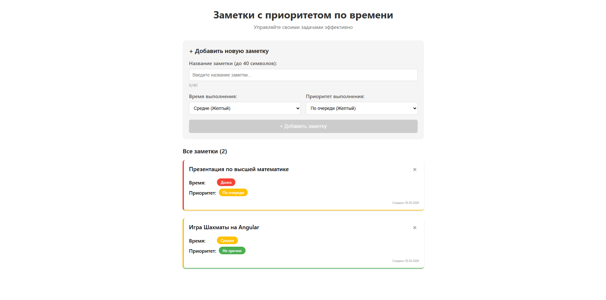

# TaskPlan — Пет-проект разработчика Зюзичева Ивана для изучения Angular и управления задачами с системой приоритетов

**Дисклеймер**: Этот проект создан в образовательных целях для изучения экосистемы Angular, сигналов, компонентного подхода и работы с локальным хранилищем браузера. 

## О проекте

**TaskPlan** — это веб-приложение для управления заметками с гибкой системой приоритетов. Проект создан для глубокого погружения в архитектуру Angular и изучения современных подходов к разработке:

- Изучение компонентной архитектуры Angular
- Практика работы с сигналами (signals) для реактивного управления состоянием
- Понимание взаимодействия между компонентами через @Input() и @Output()
- Реализация CRUD операций с сохранением в localStorage
- Разработка UI с динамическими стилями в зависимости от статуса задачи

Проект **демонстрирует лучшие практики** разработки на Angular и может служить отправной точкой для более крупных проектов.

---

## Важно

- Проект создан исключительно в образовательных целях
- Не является коммерческим продуктом
- Все права на код принадлежат автору

Если у вас есть вопросы по проекту или вы хотите предложить сотрудничество — свяжитесь со мной!

## Внешний вид

<p align="center">
  
</p>

## Функционал

### Управление заметками
-  **Создание заметок** — добавление новых задач с ограничением до 40 символов
- **Удаление заметок** — быстрая очистка выполненных или ненужных задач
- **Автосохранение** — все заметки сохраняются в localStorage браузера

### Система приоритетов

#### По времени выполнения:
- 🟢 **Быстро** — задача, которую можно решить оперативно
- 🟡 **Средне** — задача средней трудоемкости
- 🔴 **Долго** — объемная задача, требующая времени

#### По важности:
- 🔴 **Срочно** — требует немедленного внимания
- 🟡 **По очереди** — стандартный приоритет, выполняется в порядке очереди
- 🟢 **Не срочно** — может подождать, выполняется позже

### Визуальные индикаторы
- Каждая карточка заметки имеет цветовую индикацию по двум осям приоритетов
- Левая граница показывает время выполнения
- Нижняя граница показывает приоритет выполнения
- Цветные бейджи с текстовым описанием

### Особенности интерфейса
- Адаптивный дизайн (десктоп и мобильные устройства)
- Подсчет количества активных заметок
- Отображение даты создания каждой заметки
- Hover-эффекты на карточках для лучшего UX

---

## Технологии

### Фронтенд
- **Angular 19** — современный фреймворк от Google
- **TypeScript** — типизированный JavaScript
- **Signals** — реактивное управление состоянием
- **SCSS** — препроцессор для CSS
- **Standalone Components** — модульная архитектура без NgModule

### Инструменты разработки
- **Angular CLI** — генерация компонентов и сервисов
- **LocalStorage API** — хранение данных в браузере

### Установка и запуск
## Требования
Node.js (версия 18 или выше)

npm (менеджер пакетов)

Angular CLI (устанавливается автоматически)

## 1. Клонируйте репозиторий
``` bash
git clone https://github.com/IvanZuzichev/TaskPlan.git
cd taskplan
```
## 2. Установите зависимости
``` bash
npm install
```
Эта команда установит все необходимые пакеты:

Angular фреймворк

TypeScript

RxJS

Инструменты разработки

## 3. Запустите проект в режиме разработки
``` bash
ng serve
```
После запуска вы увидите:

Compiled successfully.
Browser application bundle generation complete.
** Angular Live Development Server is listening on localhost:4200 **

## 4. Откройте в браузере
``` bash
http://localhost:4200
```
Приложение автоматически перезагрузится при любых изменениях в коде.


### Контакты
Иван Зюзичев (Frontend/Fullstack Developer)

Telegram: @Ivanziz

Email: ivan.ziuzichev@gmail.com

## Если ваша компания ищет frontend-разработчика/fullstack-разработчика — я открыт к предложениям и интересным задачам.

## Готов пройти собеседование, техническое задание и включиться в команду.


### © Лицензия
Все права защищены.

Авторское право на исходный код принадлежит Ивану Зюзичеву.
